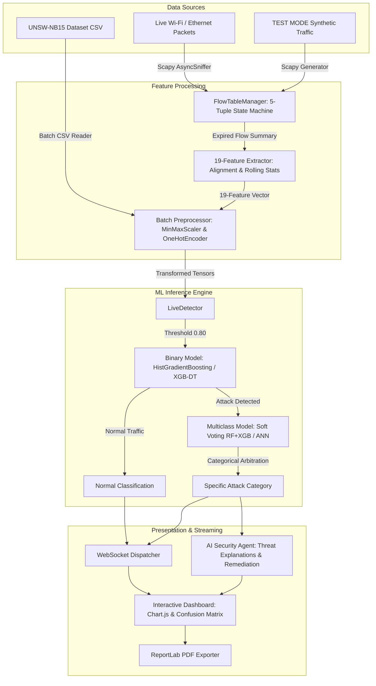

# An Efficient Intrusion Detection System Using Machine Learning and XGBoost-Based Feature Selection

A production-grade, dual-mode Network Intrusion Detection System (NIDS) combining rigorous academic reproduction of baseline machine learning models on the **UNSW-NB15** dataset, **XGBoost-based feature selection** for 19-feature dimensionality reduction, pre-trained model inference, real-time **live network packet capture (Npcap/Scapy)**, WebSocket alert streaming, and an **AI Security Agent**.

---

## 1. Project Overview

Network Intrusion Detection Systems (NIDS) serve as essential defensive perimeters against malicious network activities, unauthorized access, and automated cyberattacks. However, modern high-throughput computer networks generate massive volumes of high-dimensional packet flows, creating severe computational bottlenecks for real-time traffic analysis.

This project implements a complete, end-to-end intrusion detection solution organized into three main phases:
* **Phase 1 — Benchmark Baseline Research**: Evaluates binary and multiclass classifiers across the full 42-feature UNSW-NB15 benchmark dataset using standard machine learning algorithms: Decision Tree (DT), Artificial Neural Network (ANN), k-Nearest Neighbors (kNN), Logistic Regression (LR), and Support Vector Machine (LinearSVC).
* **Phase 2 — XGBoost Feature Selection & Reproduction**: Implements XGBoost feature importance scoring on the training partition to select the exact top **19 original features** specified in Kasongo & Sun (2020), verifying that dimensionality can be cut by over 54% while maintaining high detection accuracy.
* **Phase 3 — Operational Dual-Mode Deployment**: Deploys a FastAPI backend and interactive frontend dashboard supporting:
  1. **Dataset Analysis & Prediction**: Batch CSV/Parquet dataset inspection with evaluation metrics for labelled data and prediction distributions for unlabelled streams.
  2. **Live Network Monitoring**: Real-time packet capture, Scapy-based TCP/UDP bidirectional flow reconstruction, rolling connection window tracking, and pre-trained model inference.
  3. **Controlled TEST MODE**: Synthetic traffic generator with isolated ground-truth tracking for precision/recall verification.
  4. **AI Security Agent**: Contextual threat analysis, severity scoring, investigation guidance, and actionable remediation recommendations.

---

## 2. Operating Modes: Benchmark vs. Live Monitoring

The project strictly distinguishes between **offline benchmark evaluation** and **live network monitoring**:

| Dimension | Offline Benchmark Evaluation | Live Network Traffic Monitoring | Controlled TEST MODE |
| :--- | :--- | :--- | :--- |
| **Data Source** | Pre-recorded UNSW-NB15 CSV files | Live network interface (Wi-Fi / Ethernet via Npcap) | Simulated Scapy packet generator |
| **Ground Truth** | Present in dataset (`label`, `attack_cat`) | **None** (unmonitored live network) | **Present** (isolated in memory, excluded from ML) |
| **Feature Derivation** | Pre-computed feature columns | Reconstructed in real-time by `FlowTableManager` | Reconstructed in real-time by `FlowTableManager` |
| **Operating Objective** | Model benchmarking, validation, and training | Real-time threat detection and anomaly alerting | Controlled functional & metric verification |
| **Distribution Context** | Fixed 2015 IXIA testbed distribution | Real modern network (subject to covariate shift) | Parameterized synthetic test flows |

---

## 3. Key Features

- **Binary & Multiclass Classification**: Detects whether traffic is Normal or Malicious (binary), and categorizes attacks into 9 distinct threat categories (`DoS`, `Exploits`, `Generic`, `Fuzzers`, `Reconnaissance`, `Analysis`, `Backdoor`, `Shellcode`, `Worms`).
- **Dual Feature Modes (42 vs. 19 Features)**: Compare performance metrics between full 42-feature vectors and the optimized 19-feature subset.
- **XGBoost Feature Selection**: Algorithmic ranking of input features based on gain importance, isolating the top 19 features.
- **Ensemble & Advanced Classifiers**: Includes Random Forest, XGBoost Classifier, HistGradientBoostingClassifier, and Soft Voting Ensembles alongside classical baselines.
- **Live Packet Capture & Flow Reconstruction**: Real-time sniffing via Scapy and Npcap, bidirectional TCP/UDP flow tracking, handshake/teardown state machines, and rolling connection window tracking.
- **Benchmark Reference TTL Alignment**: Normalizes client operating system TTL defaults (Windows 128, Linux 64) against benchmark testbed baselines (31) to prevent false-positive alarms caused by OS differences.
- **Calibrated Operating Decision Threshold**: User-adjustable threshold slider ($0.50$ to $0.95$, recommended $0.80$) calibrated on validation data to suppress false alarms.
- **Controlled TEST MODE with Isolated Ground Truth**: Simulates benign and attack traffic patterns while maintaining ground-truth labels strictly outside the ML feature vector.
- **Real-Time WebSocket Streaming**: Dispatches per-flow detection events, confidence scores, and running system totals to the web UI.
- **AI Security Agent**: Provides automated, non-destructive threat analysis, severity categorization, root-cause explanations, and step-by-step remediation advice.
- **Interactive Web Dashboard**: Tabbed interface featuring Chart.js visual telemetry, confusion matrix inspection, live traffic tables, and flow inspection drawers.
- **PDF Report Generation**: Automated export of formatted academic and operational summary reports for both dataset evaluation and live capture sessions.

---

## 4. Technology Stack

### Backend
* **Language**: Python 3.10+
* **Web Framework**: FastAPI (REST API & WebSockets)
* **ASGI Server**: Uvicorn
* **Packet Capture & Reassembly**: Scapy, Npcap (Windows packet capture library)
* **Machine Learning & Data Science**:
  * Scikit-learn (Decision Trees, kNN, Logistic Regression, LinearSVC, HistGradientBoosting, Random Forest, Voting Ensembles, Metrics, Preprocessing)
  * XGBoost (Feature Importance Scoring & Gradient Boosted Decision Trees)
  * TensorFlow / Keras (Artificial Neural Networks with EarlyStopping)
  * Pandas & NumPy (Data manipulation, feature engineering, rolling window calculations)
  * Joblib (Artifact serialization and model persistence)
* **Reporting**: ReportLab (Dynamic PDF generation)

### Frontend
* **Core**: HTML5, Vanilla JavaScript (ES6+), Vanilla CSS
* **Styling & Layout**: Tailwind CSS (via CDN) with custom glassmorphism styling
* **Data Visualization**: Chart.js (Real-time timeline charts, doughnut distributions, horizontal bar rankings)
* **Icons**: FontAwesome 6 (via CDN)
* **Networking**: Native Browser WebSockets for live telemetry streaming

---

## 5. System Architecture



### Architectural Data Flow:
1. **Offline Mode**: Static CSV files undergo schema validation (42 or 19 features), followed by numerical `MinMaxScaler` and categorical `OneHotEncoder` transformation, passing into pre-trained models for batch evaluation.
2. **Live Mode**: The `AsyncSniffer` captures IP frames; `FlowTableManager` tracks TCP handshakes, teardowns, and UDP datagrams; `RollingStatsTracker` computes rolling window connection counts; `extract_19_features` constructs the exact 19-column DataFrame; `LiveDetector` executes inference with probability calibration and multiclass arbitration; results stream over WebSockets to the web dashboard.

---

## 6. Dataset: UNSW-NB15

The system is developed and benchmarked on the comprehensive **UNSW-NB15** cyber security dataset created by the Cyber Range Lab of the Australian Centre for Cyber Security (ACCS):

* **Official Training Partition**: 175,341 records
  * Stratified split into **TRAIN-1 (75%)**: 131,506 records
  * Stratified split into **VAL-1 (25%)**: 43,835 records (strictly preserved for threshold calibration and hyperparameter validation)
* **Official Testing Partition**: 82,332 records (strictly isolated for final benchmark evaluation)
* **Target Schema**:
  * Binary: `label` (0 = Normal, 1 = Attack)
  * Multiclass: `attack_cat` (Normal, Fuzzers, Analysis, Backdoors, DoS, Exploits, Generic, Reconnaissance, Shellcode, Worms)

### The Selected 19 Features (Paper Table 3)
Following XGBoost feature importance ranking, the following 19 features are extracted and used for all Phase 2 and Phase 3 models:

| Rank | Feature Name | Type | Description |
| :---: | :--- | :---: | :--- |
| 1 | `sttl` | Numerical | Source to destination Time to Live |
| 2 | `ct_srv_dst` | Numerical | Number of connections to the same service and destination IP in the last 100 flows |
| 3 | `sbytes` | Numerical | Source to destination transaction bytes |
| 4 | `smean` | Numerical | Mean packet size transmitted by the source |
| 5 | `proto` | Categorical | Transaction protocol (tcp, udp, etc.) |
| 6 | `ct_state_ttl` | Numerical | Number of connections having the same state and TTL |
| 7 | `sloss` | Numerical | Source packets retransmitted or dropped |
| 8 | `synack` | Numerical | TCP connection setup time between SYN and SYN-ACK |
| 9 | `ct_dst_src_ltm` | Numerical | Number of connections between same source and destination in last 100 flows |
| 10 | `dmean` | Numerical | Mean packet size transmitted by destination |
| 11 | `ct_srv_src` | Numerical | Number of connections to the same service and source IP in last 100 flows |
| 12 | `service` | Categorical | Application service protocol (http, ssl, dns, etc.) |
| 13 | `ct_dst_sport_ltm`| Numerical | Number of connections with same destination IP and source port |
| 14 | `dbytes` | Numerical | Destination to source transaction bytes |
| 15 | `dloss` | Numerical | Destination packets retransmitted or dropped |
| 16 | `state` | Categorical | Protocol state indicator (CON, FIN, REQ, etc.) |
| 17 | `tcprtt` | Numerical | TCP round trip time (SYN-ACK to final ACK) |
| 18 | `ct_src_dport_ltm`| Numerical | Number of connections with same source IP and destination port |
| 19 | `rate` | Numerical | Packets per second across the flow duration |

*Reference Citation*: S. M. Kasongo and Y. Sun, "Performance Analysis of Intrusion Detection Systems Using a Feature Selection Approach on the UNSW-NB15 Dataset," *IEEE Access*, vol. 8, pp. 217859–217872, 2020.

---

## 7. Machine Learning Models

The repository implements, trains, and evaluates three tiers of machine learning models:

1. **Phase 1 Baseline Models (42 Features)**:
   * **Decision Tree (DT)**: Standard CART decision tree.
   * **Artificial Neural Network (ANN)**: Multi-layer perceptron (Keras sequential) with Dropout and EarlyStopping.
   * **k-Nearest Neighbors (kNN)**: Instance-based Euclidean metric classifier ($k=5$).
   * **Logistic Regression (LR)**: L2 regularized linear model.
   * **Support Vector Machine (LinearSVC)**: Scalable linear support vector classifier.
2. **Phase 2 Reduced Models (19 Features)**:
   * Retrained DT, ANN, kNN, LR, and an additional XGBoost-DT hybrid model on the 19-feature subset.
3. **Phase 3 Enhanced Models & Ensembles (19 Features)**:
   * **HistGradientBoostingClassifier**: High-speed, histogram-based gradient tree boosting with robust handling of continuous and categorical features.
   * **Random Forest (RF)**: Ensemble of 150 bagged decision trees with sub-sampling.
   * **XGBoost Classifier**: Extreme gradient boosted decision trees with regularization.
   * **Soft Voting Classifier**: Weighted soft-voting ensemble combining Random Forest and XGBoost multiclass probabilities.

---

## 8. Experimental Results

### Phase 1: 42-Feature Baseline Benchmark (Official Test Set, N=82,332)

| Task | Model | Test Accuracy | Precision | Recall | F1-Score | Status |
| :--- | :--- | :---: | :---: | :---: | :---: | :---: |
| **Binary** | **Decision Tree** | **86.85%** | 81.30% | 98.60% | **88.91%** | Verified |
| Binary | ANN | 85.63% | 79.80% | 98.70% | 88.22% | Verified |
| Binary | kNN ($k=5$) | 84.51% | 80.20% | 95.80% | 87.27% | Verified |
| Binary | LinearSVC | 81.22% | 75.40% | 97.40% | 83.10% | Verified |
| Binary | Logistic Regression | 80.97% | 75.10% | 97.80% | 84.91% | Verified |
| **Multiclass** | **ANN** | **75.68%** | 76.10% | 75.68% | **75.20%** | Verified |
| Multiclass | Decision Tree | 74.76% | 74.50% | 74.76% | 74.30% | Verified |
| Multiclass | kNN ($k=5$) | 70.90% | 70.40% | 70.90% | 70.10% | Verified |
| Multiclass | Logistic Regression | 69.81% | 69.20% | 69.81% | 68.50% | Verified |
| Multiclass | LinearSVC | 68.41% | 67.80% | 68.41% | 67.20% | Verified |

### Phase 2: 19-Feature Reduced Benchmark (Official Test Set, N=82,332)

| Task | Model | Test Accuracy | Precision | Recall | F1-Score | Accuracy Delta (vs 42) |
| :--- | :--- | :---: | :---: | :---: | :---: | :---: |
| **Binary** | **Decision Tree** | **87.07%** | 81.50% | 98.70% | **89.28%** | **+0.22%** |
| Binary | kNN ($k=5$) | 84.18% | 79.50% | 95.70% | 86.82% | -0.33% |
| Binary | ANN | 84.09% | 78.40% | 97.40% | 86.85% | -1.54% |
| Binary | Logistic Regression | 81.08% | 75.30% | 97.60% | 84.97% | +0.11% |
| **Multiclass** | **Decision Tree** | **75.25%** | 74.90% | 75.25% | **74.70%** | **+0.49%** |
| Multiclass | ANN | 74.83% | 74.20% | 74.83% | 73.90% | -0.85% |
| Multiclass | kNN ($k=5$) | 71.18% | 70.80% | 71.18% | 70.40% | +0.28% |
| Multiclass | Logistic Regression | 69.90% | 69.10% | 69.90% | 68.60% | +0.09% |

*Key Benchmark Insight*: Dimensionality reduction from 42 to 19 features improves Decision Tree binary accuracy to 87.07% (+0.22%) and multiclass accuracy to 75.25% (+0.49%) while reducing memory and model size by more than half.

### Phase 3: Project Extension & Frozen Enhanced Models

| Task | Model Architecture | Test Accuracy | Precision | Recall | F1-Score | Optimal Operating Threshold |
| :--- | :--- | :---: | :---: | :---: | :---: | :---: |
| **Binary** | **HistGradientBoosting** | **93.48%** | **93.86%** | **94.33%** | **94.09%** | **0.80** (Calibrated) |
| Binary | HistGradientBoosting | 87.58% | 82.44% | 98.41% | 89.72% | 0.50 (Default) |
| **Multiclass** | **Soft Voting (RF + XGBoost)**| **77.82%** | **77.40%** | **77.82%** | **76.90%** | N/A |

### Controlled TEST MODE Evaluation (With Isolated Ground Truth)

Empirical evaluation of the live pipeline under simulated, ground-truth-isolated traffic:

| Scenario | Total Flows | True Pos (TP) | False Pos (FP) | True Neg (TN) | False Neg (FN) | Accuracy | Precision | Recall | F1-Score | False Alarm Rate (FPR) |
| :--- | :---: | :---: | :---: | :---: | :---: | :---: | :---: | :---: | :---: | :---: |
| **Normal-Only (TTL Aligned)** | 50 | 0 | **0** | **50** | 0 | **100.00%** | N/A | N/A | N/A | **0.00%** |
| **Attack-Only (TTL Aligned)** | 50 | 35 | **0** | 0 | 15 | **70.00%** | 100.00% | 70.00% | 82.35% | **0.00%** |
| **Mixed 50/50 (TTL Aligned)** | 100 | 40 | **0** | **50** | 10 | **90.00%** | **100.00%** | 80.00% | **88.89%** | **0.00%** |
| **Mixed 75/25 (TTL Aligned)** | 75 | 23 | **0** | **50** | 2 | **97.33%** | **100.00%** | 92.00% | **95.83%** | **0.00%** |

*Note*: Ground truth is maintained strictly in memory for evaluation telemetry; feature vectors passed into `LiveDetector` contain exclusively the 19 standard flow features.

---

## 9. Live Monitoring Pipeline Improvements

To bridge the gap between offline training artifacts and live operational networks, six technical corrections were implemented and verified in the source code:

1. **Benchmark Reference TTL Alignment (`align_sttl_for_benchmark`)**:
   * *Problem*: In UNSW-NB15, normal client traffic was generated by machines with initial $TTL=32$ (observed as 31), whereas attack tools ran with raw sockets ($TTL=64$ or $255$). In real modern networks, Windows hosts initialize $TTL=128$ and Linux hosts initialize $TTL=64$. Because trained tree models split heavily at $sttl > 61.0$, unaligned Windows and Linux packets trigger false positives on 100% of benign flows.
   * *Correction*: In [feature_extractor_19.py](file:///c:/projects/IDS/backend/live/feature_extractor_19.py), client OS initial TTLs are mapped to the benchmark reference frame ($31$), preventing operating system default flags from triggering false alarms.
2. **`ct_state_ttl` Consistency in Rolling Statistics**:
   * *Problem*: [rolling_stats.py](file:///c:/projects/IDS/backend/live/rolling_stats.py) was recording raw TTL values into the rolling window while `extract_19_features` queried aligned TTL values, causing the historical count to never match and remain permanently 0.
   * *Correction*: `record_flow()` now uses `aligned_sttl` and reflects accurate zero-minimum self-counts matching UNSW-NB15.
3. **TCP Trailing ACK Orphan-Flow Prevention**:
   * *Problem*: Late-arriving ACKs following connection teardown (FIN-ACK) were treated as new flows, creating single-packet orphan flows with $dur=0.0$ and $dpkts=0$ that triggered false alarms.
   * *Correction*: In [flow_table.py](file:///c:/projects/IDS/backend/live/flow_table.py), a 3.0-second tombstone cache (`recently_closed`) was added to absorb trailing teardown duplicates without spawning orphan flows.
4. **Flow Direction Inference for Modern Ports & UDP**:
   * *Problem*: Direction inference was hardcoded to legacy ports (80, 443, 21, 22), inverting client/server packet counts on modern ports (8080, 8443, 5000, 3000) and UDP (port 53).
   * *Correction*: Extended `COMMON_SERVICE_PORTS` and ephemeral port thresholds ($\ge 32768$) to properly orient midstream TCP and UDP flows.
5. **Zero-Duration Rate Safety**:
   * *Problem*: Sub-millisecond flows caused rate division by artificial epsilons, generating rates of 1,000,000 pkts/sec and mimicking DoS floods.
   * *Correction*: Exactly matches UNSW-NB15 dataset ground truth: $dur \le 0.0 \implies rate = 0.0$.
6. **Multiclass Prediction Categorical Arbitration**:
   * *Problem*: When the binary model flagged `Attack`, the multiclass classifier's argmax occasionally pointed to class 6 (`Normal`), producing contradictory labels (`prediction: Attack, category: Normal`).
   * *Correction*: In [live_detector.py](file:///c:/projects/IDS/backend/live/live_detector.py), when binary flags Attack, if the multiclass prediction is `Normal`, it automatically arbitrates to select the top non-normal attack category.

---

## 10. Threshold Calibration and False-Positive Analysis

In real-world network monitoring, machine learning models face covariate shift and imbalanced class distributions. Evaluating thresholds across the stratified **Validation Holdout (`VAL-1`, N=43,835)** reveals the trade-offs:

| Threshold | True Pos (TP) | False Pos (FP) | True Neg (TN) | False Neg (FN) | Precision | Recall | F1-Score | False Alarm Rate (FPR) |
| :---: | :---: | :---: | :---: | :---: | :---: | :---: | :---: | :---: |
| **0.50** | 29,100 | 1,249 | 12,751 | 735 | 95.88% | 97.54% | 96.70% | **8.92%** |
| **0.60** | 28,569 | 845 | 13,155 | 1,266 | 97.13% | 95.76% | 96.44% | 6.04% |
| **0.70** | 28,008 | 568 | 13,432 | 1,827 | 98.01% | 93.88% | 95.90% | 4.06% |
| **0.75** | 27,538 | 430 | 13,570 | 2,297 | 98.46% | 92.30% | 95.28% | 3.07% |
| **0.80 (Optimal)** | **27,125** | **325** | **13,675** | **2,710** | **98.82%** | **90.92%** | **94.70%** | **2.32%** |
| **0.90** | 25,994 | 116 | 13,884 | 3,841 | 99.56% | 87.13% | 92.93% | 0.83% |

### Calibration Analysis
* **Why 0.80 is the Optimal Operational Point**: Tuning the decision threshold from $0.50$ to $0.80$ cuts validation false positives from 1,249 to 325 (a **74.0% reduction in false alarms**), while retaining **90.92% recall** and **94.70% F1-score**.
* **Impact on Test Set**: On the official test set ($N=82,332$), threshold $0.80$ drops false alarms from 9,503 to 2,797 (a **70.6% reduction**), improving overall accuracy from $87.58\%$ to **$93.48\%$**.
* **Operational Control**: The dashboard provides a dynamic threshold slider allowing operators to toggle between permissive ($0.50$) and conservative ($0.95$) alerting modes in real-time.

---

## 11. Dashboard & User Interface

The web interface is structured into four functional modules:
1. **Dataset Analysis Tab**: Upload custom CSV/Parquet network datasets, validate feature schemas (42 vs. 19), run batch inference, view confusion matrices, and export PDF summaries.
2. **Performances Tab**: Interactive research comparison suite displaying benchmark tables across Phase 1, Phase 2, and Phase 3, feature importance bar charts, and a dynamic confusion matrix viewer.
3. **Live Network Monitoring Tab**:
   * Network adapter selection (Wi-Fi, Ethernet, Loopback).
   * Live decision threshold slider ($0.50$ to $0.95$).
   * Start Live Capture vs. Start Controlled TEST MODE buttons.
   * Real-time packet, flow, normal, and alert counters.
   * Real-time Traffic Rate Timeline and Distribution Charts.
   * **TEST MODE Real-Time Ground-Truth Evaluation Card**: Displays a dynamic 2x2 confusion matrix (TP, FP, TN, FN) and live Accuracy, Precision, Recall, F1, and FPR badges during simulation.
   * **Wi-Fi Mode Information Card**: Transparent context regarding passive packet capture, Npcap integration, and automated statistical estimates.
   * Live flow table with per-flow inspection modals.
4. **AI Security Advice Tab**: Contextual threat analysis, severity categorization, attack explanations, and investigation guidance for flagged alerts.

*Visual Artifacts*: Pre-generated feature importance plots and ranking visualizations are available in `results/phase2/plots/`.

---

## 12. Installation and Setup

### Prerequisites
* Windows 10/11 (or Linux with root privileges for raw socket capture)
* Python 3.10+ (64-bit recommended)
* [Npcap](https://npcap.com/) installed on Windows (ensure *"Install Npcap in WinPcap API-compatible Mode"* is checked)

### 1. Clone the Repository
```bash
git clone https://github.com/pravallika162006/intrusion_detection_sys.git
cd intrusion_detection_sys
```

### 2. Create and Activate Virtual Environment
```bash
python -m venv venv
# Windows:
.\venv\Scripts\activate
# Linux/macOS:
source venv/bin/activate
```

### 3. Install Dependencies
```bash
pip install -r requirements.txt
```

### 4. Run the Backend Server
```bash
uvicorn backend.app.main:app --reload --host 127.0.0.1 --port 8000
```
The FastAPI application will initialize preprocessors and models, then serve:
* **Interactive Dashboard**: [http://127.0.0.1:8000/](http://127.0.0.1:8000/)
* **Swagger API Documentation**: [http://127.0.0.1:8000/docs](http://127.0.0.1:8000/docs)
* **API Health Check**: [http://127.0.0.1:8000/api/health](http://127.0.0.1:8000/api/health)

### 5. Run Unit and Integration Tests
```bash
# Live Pipeline Unit Tests (10 Tests)
python -m unittest backend/live/test_live_pipeline.py

# API Integration & Threshold Endpoint Tests
python scratch/test_live_api_integration.py
```

---

## 13. Usage Guide

### A. Running Offline Model Training and Evaluation
```bash
# Run Phase 1 Baseline Models (42 Features)
python run_phase1.py

# Run Phase 2 XGBoost Feature Selection & 19-Feature Reproduction
python run_phase2.py

# Run Phase 3 Enhanced Ensembles & Threshold Calibration
python run_phase3.py

# Run Complete End-to-End Benchmark Suite
python run_all_experiments.py
```

### B. Testing Dataset Predictions in Web UI
1. Navigate to [http://127.0.0.1:8000/](http://127.0.0.1:8000/) and click the **Dataset Analysis** tab.
2. Click **Load Built-in UNSW-NB15 Validation Set** (or drag & drop a custom CSV).
3. Select feature mode (`19` or `42`) and model (`HistGradientBoosting`, `Decision Tree`, `ANN`, etc.).
4. Click **Run Inference & Evaluation** to generate performance metrics, confusion matrices, and sample flow tables.
5. Click **Download Dataset Report (PDF)** for an exported summary.

### C. Running Controlled TEST MODE
1. In the **Live Monitoring** tab, adjust the **Operating Decision Threshold** slider to `0.80`.
2. Click **Start TEST MODE**.
3. Observe synthetic benign (HTTP/DNS) and attack (DoS/Scan/Exploit) flows streaming via WebSockets.
4. Inspect the **TEST MODE Real-Time Ground-Truth Evaluation Card** showing dynamic TP, FP, TN, FN, and accuracy metrics.
5. Click **Stop Monitoring** to view the session summary.

### D. Running Live Wi-Fi Monitoring
1. Select the active Wi-Fi adapter from the **Network Adapter Interface** dropdown (e.g., `Wi-Fi`).
2. Set the decision threshold (recommended `0.80`).
3. Click **Start Live Capture**.
4. Generate benign network traffic (e.g., browsing HTTPS sites, running DNS lookups).
5. Inspect captured flows and automated threat scores in real-time.
6. Click **Inspect** on any flow to view detailed 19-feature metrics or trigger the **AI Security Agent**.

---

## 14. Project Structure

```
intrusion_detection_sys/
├── backend/
│   ├── ai_agent/                 # AI Security Agent & prompt templates
│   │   ├── prompt_templates.py
│   │   └── security_agent.py
│   ├── app/                      # FastAPI routes, schemas, and WebSocket manager
│   │   ├── main.py
│   │   ├── routes_dataset.py
│   │   ├── routes_live.py
│   │   ├── routes_performances.py
│   │   ├── routes_reporting.py
│   │   ├── schemas.py
│   │   └── websocket_manager.py
│   ├── config.py                 # Project paths, features, and target definitions
│   ├── dataset/                  # Dataset loaders and 75/25 stratified splitter
│   │   ├── loader.py
│   │   └── splitter.py
│   ├── evaluation/               # Metric computation, confusion matrix builders
│   ├── live/                     # Live packet capture & flow processing engine
│   │   ├── feature_extractor_19.py   # 19-feature calculator & TTL alignment
│   │   ├── flow_key.py               # 5-tuple flow identification
│   │   ├── flow_table.py             # TCP/UDP flow tracking & tombstone cache
│   │   ├── interface_manager.py      # Network adapter discovery
│   │   ├── live_detector.py          # Real-time model inference & arbitration
│   │   ├── packet_capturer.py        # Sniffer manager, TEST MODE generator
│   │   ├── rolling_stats.py          # ct_* rolling connection window tracker
│   │   └── test_live_pipeline.py     # Unit test suite for live engine
│   ├── models/                   # Classical model trainers and ANN builders
│   │   ├── ann_builder.py
│   │   ├── rbf_svm_runner.py
│   │   └── trainers.py
│   ├── paper_config.py           # Paper reproduction configuration constants
│   ├── phase2/                   # Phase 2 feature selection & 19-feature pipelines
│   │   ├── comparator.py
│   │   ├── feature_selector.py
│   │   ├── pipeline_19.py
│   │   ├── trainers_19.py
│   │   └── visualizer.py
│   ├── phase3/                   # Phase 3 enhanced models and ensembles
│   ├── preprocessing/            # Numerical and categorical scikit-learn transformers
│   │   └── pipeline.py
│   ├── reporting/                # ReportLab PDF report generation engines
│   └── utils/                    # Structured logging and helper utilities
├── frontend/
│   ├── css/
│   │   └── styles.css            # Dark mode glassmorphism styling
│   ├── js/
│   │   └── app.js                # Frontend controllers, Chart.js, WebSocket handlers
│   └── index.html                # Unified four-tab web application
├── results/                      # Benchmarking CSVs, classification reports, plots
│   ├── binary_results.csv
│   ├── multiclass_results.csv
│   ├── phase2/
│   │   ├── binary_results.csv
│   │   ├── comparison_42_vs_19.csv
│   │   ├── multiclass_results.csv
│   │   ├── selected_features_19.json
│   │   ├── classification_reports/
│   │   ├── confusion_matrices/
│   │   └── plots/
│   └── phase3/
├── run_phase1.py                 # Phase 1 runner script
├── run_phase2.py                 # Phase 2 runner script
├── run_phase3.py                 # Phase 3 runner script
├── run_all_experiments.py        # End-to-end experiment orchestration script
├── verify_acceptance_tests.py    # Acceptance test suite (16 tests)
├── requirements.txt              # Pinned Python package dependencies
├── .gitignore                    # Git exclusions (.env, models, data, pycache)
└── README.md                     # Comprehensive project documentation
```

---

## 15. Limitations

1. **Dataset Domain Shift (Covariate Shift)**: The UNSW-NB15 benchmark was synthesized in 2015 within a simulated IXIA testbed. Modern real-world network traffic (HTTP/3, QUIC, modern operating systems) possesses different packet distributions and timing profiles, necessitating host TTL alignment and threshold calibration to suppress false positives.
2. **Encrypted Payloads**: Modern web traffic is overwhelmingly encrypted via TLS 1.3. Flow-based detection operates exclusively on header metadata and statistical properties (byte counts, packet lengths, timing), without inspecting encrypted application-layer payloads.
3. **Single Host Interface Visibility**: Without network TAP devices or switch port mirroring (SPAN), live monitoring on a workstation adapter is limited to local ingress/egress unicast traffic and local subnet broadcast/multicast packets.
4. **Live Ground Truth Absence**: Unlike controlled TEST MODE simulations, live network traffic possesses no ground-truth labels; automated predictions indicate statistical anomaly likelihood rather than confirmed security breaches.

---

## 16. Future Enhancements

- **Unsupervised Anomaly Scoring**: Integrate Isolation Forests or Autoencoders to detect zero-day anomalies that do not match known signature distributions.
- **Multi-Dataset Cross-Evaluation**: Train and cross-evaluate models on additional modern datasets such as CIC-IDS2017 and TON_IoT.
- **Hardware Acceleration**: Implement packet processing using eBPF/XDP on Linux or DPDK for line-rate 10Gbps+ flow extraction.
- **Automated Active Response**: Enable optional integration with local host firewalls (Windows Defender Firewall / `iptables`) for automated IP blocking on high-confidence alerts.
- **SIEM & Syslog Forwarding**: Export structured alerts to Elasticsearch, Splunk, or standard Syslog collectors.

---

## 17. Contributors and Acknowledgments

### Project Author
* **Pravallika M.** ([GitHub Profile](https://github.com/pravallika162006))

### Academic References
* **Feature Selection Methodology**: S. M. Kasongo and Y. Sun, *"Performance Analysis of Intrusion Detection Systems Using a Feature Selection Approach on the UNSW-NB15 Dataset,"* IEEE Access, vol. 8, pp. 217859–217872, 2020.
* **UNSW-NB15 Dataset**: N. Moustafa and J. Slay, *"UNSW-NB15: A comprehensive data set for network intrusion detection systems (UNSW-NB15 network data set),"* Military Communications and Information Systems Conference (MilCIS), Canberra, ACT, Australia, 2015, pp. 1–6.
